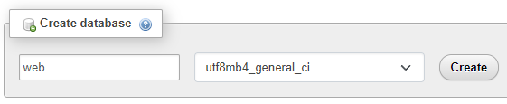
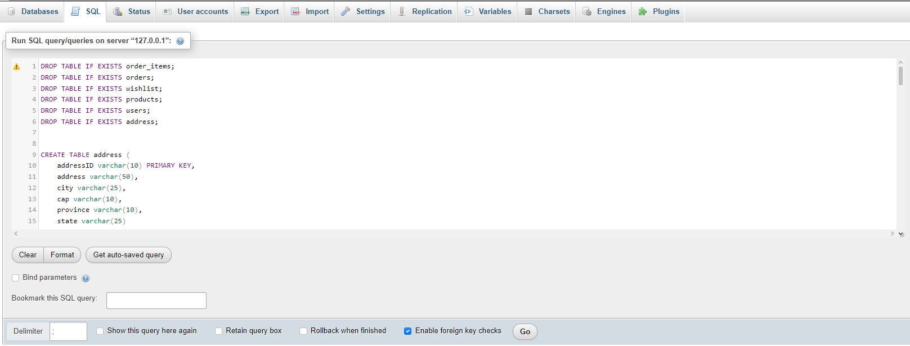

## Configurazione del database
- Per la memorizzazione e la gestione di tutti i dati del sito web, abbiamo utilizzato phpMyAdmin per la creazione e il popolamento di un database, che abbiamo chiamato "web".

- Creazione del database: Il primo passo consiste nel creare un database vuoto all'interno di phpMyAdmin, nominandolo "web".

- Successivamente, navigando nella sezione SQL dell'interfaccia, si eseguono le istruzioni contenute nel file init.sql (situato nel percorso assets/query/).

- Una volta eseguita la query, verranno create automaticamente tutte le tabelle e inseriti i dati necessari per il corretto funzionamento del sito.

